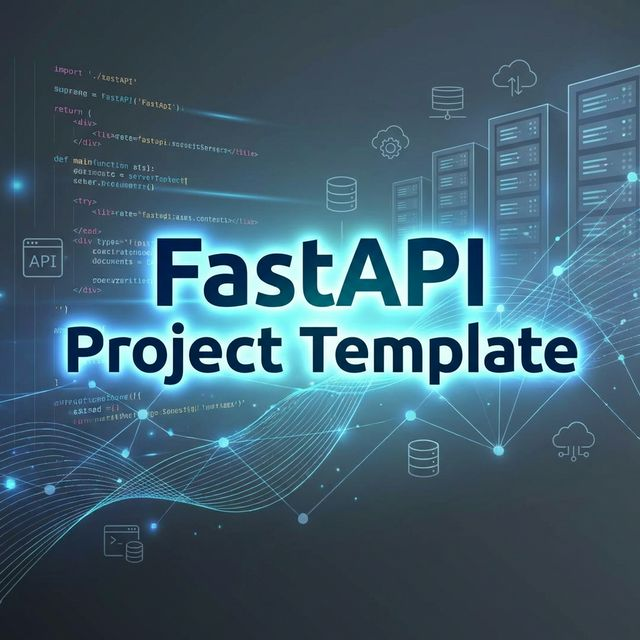

# FastAPI Project Template


這是一個為臺北市立復興高級中學學生設計的 **FastAPI** 專案範本，提供標準化的開發環境，讓你練習建構現代 Web API，並體驗真實的開源協作流程。

## 🛠️ 技術堆疊

| 項目 | 技術 |
|------|------|
| 語言 | Python 3.13+ |
| Web Framework | FastAPI |
| 套件管理 | uv |
| 資料庫 | MariaDB（via Docker）|
| ORM | SQLModel / SQLAlchemy（Async）|
| 資料庫 GUI | DbGate（via Docker）|

## 🚀 快速開始

**第一步：安裝 uv**

```bash
# macOS / Linux
curl -LsSf https://astral.sh/uv/install.sh | sh

# Windows（PowerShell）
powershell -c "irm https://astral.sh/uv/install.ps1 | iex"
```

**第二步：安裝依賴並設定環境變數**

```bash
uv sync
cp .env.example .env
```

**第三步：啟動所有服務**

```bash
docker-compose up -d
```

服務啟動後，打開瀏覽器前往 [http://localhost:8000/docs](http://localhost:8000/docs) 即可看到互動式 API 文件。

> [!NOTE]
> 完整的使用教學（包含如何新增你的第一個 API）請見 **[docs/Usage.md](./docs/Usage.md)**。

## 🤝 參與貢獻

開發協作流程、Branch 命名規則及 PR 規範，請閱讀 [CONTRIBUTING.md](./CONTRIBUTING.md)。

## 📝 授權

[Educational Community License, Version 2.0 (ECL-2.0)](LICENSE)
